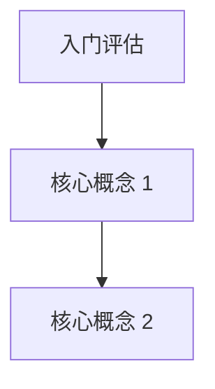

# Learning Progress Template

用于 `/tutor` 维护学习进度、知识图谱、复习队列和下一步教学动作。

## 当前状态

| 字段 | 内容 |
|------|------|
| 当前主题 |  |
| 当前模块 |  |
| 当前概念 |  |
| 掌握度 |  |
| 下一步动作 |  |
| 当前卡点 |  |

## 已完成模块

| 编号 | 模块 | 核心概念 | 掌握度 | 状态 | 备注 |
|------|------|----------|--------|------|------|
|  |  |  |  |  |  |

## 待强化知识点

| 知识点 | 问题表现 | 复习优先级 | 下次复习 | 处理策略 |
|--------|----------|------------|----------|----------|
|  |  |  |  |  |

## 间隔重复队列

| 概念 | 最近复习 | 下次复习 | 复习次数 | 状态 |
|------|----------|----------|----------|------|
|  |  |  |  |  |

## 知识图谱

## 节点状态表

| 节点 | 前置依赖 | 状态 | 掌握度 |
|------|----------|------|--------|
| 入门评估 | 无 | 未开始 | 0% |

